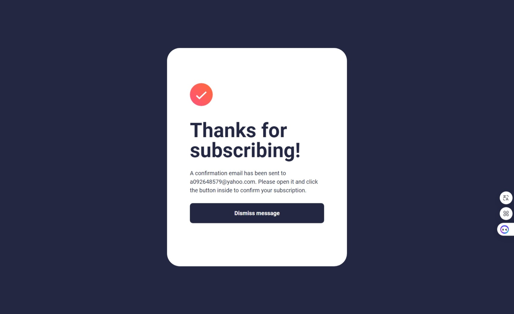

## Table of contents

- [Overview](#overview)
  - [The challenge](#the-challenge)
  - [Screenshot](#screenshot)
  - [Links](#links)
- [My process](#my-process)
  - [Built with](#built-with)
  - [What I learned](#what-i-learned)
  - [Continued development](#continued-development)
  - [Useful resources](#useful-resources)
- [Author](#author)

## Overview

### The challenge

Users should be able to:

- Add their email and submit the form
- See a success message with their email after successfully submitting the form
- See form validation messages if:
  - The field is left empty
  - The email address is not formatted correctly
- View the optimal layout for the interface depending on their device's screen size
- See hover and focus states for all interactive elements on the page

### Screenshot

-Desktop

-Mobile

-tablet

-validation and active

### Links

- Solution URL: [https://github.com/Benson0721/Newasletter-signup-form]
- Live Site URL: [https://benson0721.github.io/Newasletter-signup-form/]

## My process

### Built with

- Semantic HTML5 markup
- CSS custom properties
- Flexbox
- Scss
- TailwindCss
- Mobile-first workflow
- [React](https://reactjs.org/) - JS library

### What I learned

In this practice, the layout part wasn't too difficult for me. The main challenge was form validation; it took me some time to figure out how to implement it. I spent some time developing the validation logic myself, but formatting validation was quite a hassle. Therefore, I decided to use a library called "React Hook Form" to become more familiar with it. Completing this project required using React state concepts, which weren't too challenging in this context.

### Continued development

Keep practise the logic part of javascript that can be use in future project!

## Author

- Github - [Mpass](https://github.com/Benson0721)
- Frontend Mentor - [@Mpass](https://www.frontendmentor.io/profile/Benson0721)
